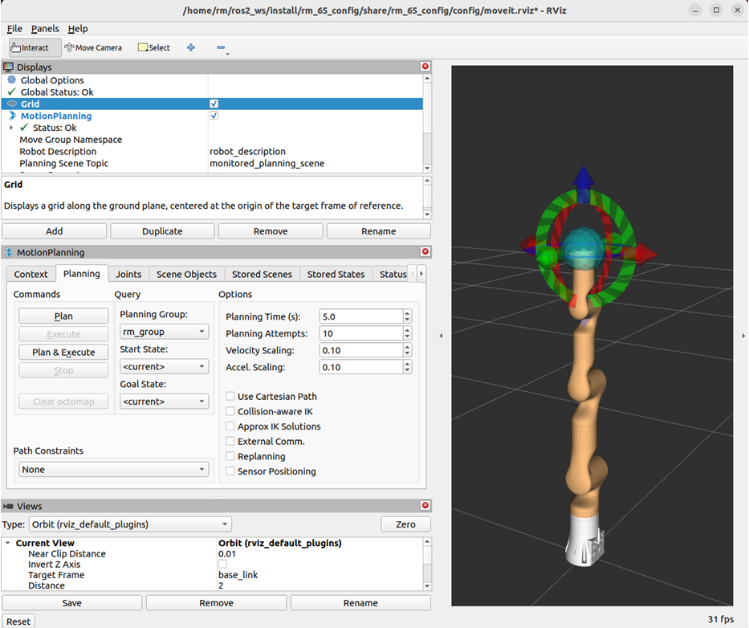
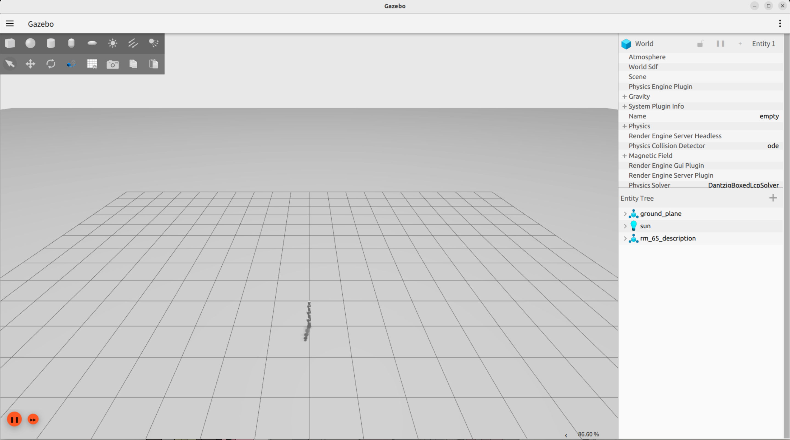
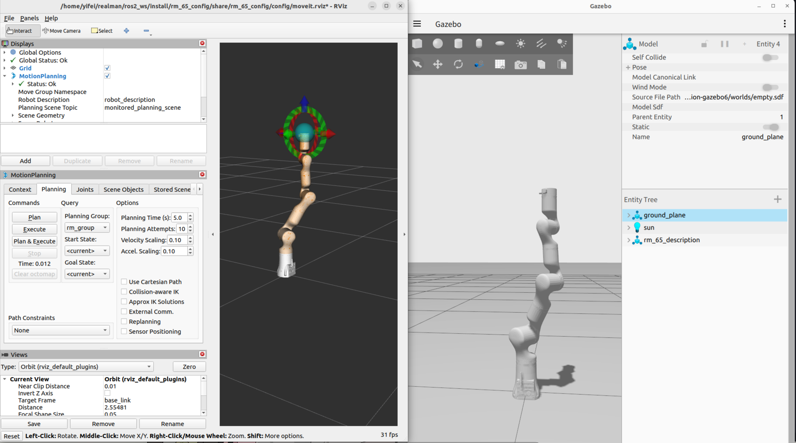

<div align="right">

[简体中文](https://github.com/RealManRobot/ros2_rm_robot/blob/humble/rm_bringup/README_CN.md)|[English](https://github.com/RealManRobot/ros2_rm_robot/blob/humble/rm_bringup/README.md)
 
</div>

<div align="center">

# RealMan Robot rm_bringup User Manual V1.6

RealMan Intelligent Technology (Beijing) Co., Ltd. 

Revision History:

|No.	  | Date   |	Comment |
| :---: | :----: | :---:   |
|V1.0	  | 2024-2-19 | Draft |
|V1.1	  | 2024-7-8 | Amend(Add GEN72 adapter files) |
|V1.2 	  | 2024-9-10 | Amend(Add ECO63 adapter files) |
|V1.3 	  | 2024-12-25 | Amend(Add 63, 65, 75, ECO65 six-axis force adapter files and 63, 65, 75, ECO63, ECO65 integrated six-axis force adapter files) |
|V1.4 	  | 2025-4-7 | Amend(Add GEN72_II adapter files) |
|V1.5 	  | 2025-11-13 | Amend(Add RML63_III adapter files) |
|V1.6 	  | 2026-4-16 | Amend(Add ECO62 and RX75 adapter files) |

</div>

## Content
* 1.[rm_bringup Package Description](#rm_bringup_Package_Description)
* 2.[rm_bringup Package Use](#rm_bringup_Package_Use)
* 2.1[moveit2 Controlling Real Robotic Arm](#moveit2_Controlling_Real_Robotic_Arm)
* 2.2[Gazebo control of robotic arm](#Gazebo_control_of_robotic_arm)
* 3.[rm_bringup Package Architecture Description](#rm_bringup_Package_Architecture_Description)
* 3.1[Overview of Package Files](#Overview_of_Package_Files)
* 4.[rm_bringup Topic Description](#rm_bringup_Topic_Description)

## rm_bringup_Package_Description
rm_bringup is a function package for realizing the simultaneous running of multiple launch files. Using this package, a command can be used to launch complex functions combining multiple nodes. This package is introduced in detail in the following aspects.
* 1.Package use.
* 2.Package architecture description.
* 3.Package topic description.  
Through the introduction of the three parts, it can help you:
* 1.Understand the package use.
* 2.Familiar with the file structure and function of the package.
* 3.Familiar with the topic related to the package for easy development and use.
Source code address: https://github.com/RealManRobot/ros2_rm_robot.git。
## rm_bringup_Package_Use
### moveit2_Controlling_Real_Robotic_Arm
First, after configuring the environment and completing the connection, we can directly launch the node and run the launch.py file in the rm_bringup package through the following command.
```
rm@rm-desktop:~$ ros2 launch rm_bringup rm_<arm_type>_bringup.launch.py
```
In practice, the above <arm_type> needs to be replaced by the actual model of the robotic arm. The available models are 65, 63, 63_III, 75, eco62, eco63, eco65, gen72, gen72_II, and rx75. For RX75, use `rm_rx75_6fb_bringup.launch.py` for RX75-6FB and `rm_rx75_6fb_v_bringup.launch.py` for RX75-6FB-V.  
The command to start the six-axis force version is currently available for 63, 65, 75, and eco65:
```
rm@rm-desktop:~$ ros2 launch rm_bringup rm_<arm_type>_6f_bringup.launch.py
```
The command to start the integrated six-axis force version is currently available for 63, 63_III, 65, 75, eco63, eco65, and rx75:
```
rm@rm-desktop:~$ ros2 launch rm_bringup rm_<arm_type>_6fb_bringup.launch.py
```
The command to start the vision-enabled integrated six-axis force version is currently only available for rx75:
```
rm@rm-desktop:~$ ros2 launch rm_bringup rm_<arm_type>_6fb_v_bringup.launch.py
```
For example, the launch command of 65 robotic arm:
```
rm@rm-desktop:~$ ros2 launch rm_bringup rm_65_bringup.launch.py
```
The following screen appears in the interface after a successful node launch.
  
The launch file launches the function of moveit2 to control the real robotic arm. Then, you can control the robotic arm movement by dragging the control ball. For details, please refer to "[rm_moveit2_config Detailed Description](https://github.com/RealManRobot/ros2_rm_robot/blob/main/rm_moveit2_config/README.md)".
### Gazebo_control_of_robotic_arm
We can run the launch.py file in the rm_bringup package through the following command, and directly launch the gzaebo simulation node.
```
rm@rm-desktop:~$ ros2 launch rm_bringup rm_<arm_type>_gazebo.launch.py
```
In practice, the above <arm_type> needs to be replaced by the actual model of the robotic arm. The available models are 65, 63, 63_III, 75, eco62, eco63, eco65, gen72, gen72_II, and rx75. For RX75, use `rm_rx75_6fb_gazebo.launch.py` for RX75-6FB and `rm_rx75_6fb_v_gazebo.launch.py` for RX75-6FB-V. 

The command to start the six-axis force version is currently available for 63, 65, 75, and eco65:
```
rm@rm-desktop:~$ ros2 launch rm_bringup rm_<arm_type>_6f_gazebo.launch.py
```
The command to start the integrated six-axis force version is currently available for 63, 63_III, 65, 75, eco63, eco65, and rx75:
```
rm@rm-desktop:~$ ros2 launch rm_bringup rm_<arm_type>_6fb_gazebo.launch.py
``` 
The command to start the vision-enabled integrated six-axis force version is currently only available for rx75:
```
rm@rm-desktop:~$ ros2 launch rm_bringup rm_<arm_type>_6fb_v_gazebo.launch.py
```
For example, the launch command of 65 robotic arm:
```
rm@rm-desktop:~$ ros2 launch rm_bringup rm_65_gazebo.launch.py
```
The following screen appears in the interface after a successful node launch.

Then, we use the following command to launch moveit2 to control the simulation robot arm in Gazebo.

## rm_bringup_Package_Architecture_Description
### Overview_of_Package_Files
The current rm_bringup package is composed of the following files.
```
├── CMakeLists.txt                     # compilation rule file
├── doc                                # Supporting documents,pictures
│   ├── rm_bringup1.png                # pictures1
│   ├── rm_bringup2.png                # pictures2
│   └── rm_bringup3.png                # pictures3
├── launch
│   ├── rm_63_6f_bringup.launch.py     # 63 arm six-axis force moveit2 launch file
│   ├── rm_63_6f_gazebo.launch.py      # 63 arm six-axis force gazebo launch file
│   ├── rm_63_6fb_bringup.launch.py    # 63 arm integrated six-axis force moveit2 launch file
│   ├── rm_63_6fb_gazebo.launch.py     # 63 arm integrated six-axis force gazebo launch file
│   ├── rm_63_bringup.launch.py        # 63 arm moveit2 launch file
│   ├── rm_63_gazebo.launch.py         # 63 arm gazebo launch file
│   ├── rm_63_III_bringup.launch.py    # 63_III arm moveit2 launch file
│   ├── rm_63_III_gazebo.launch.py     # 63_III arm gazebo launch file
│   ├── rm_63_III_6fb_bringup.launch.py # 63_III arm integrated six-axis force moveit2 launch file
│   ├── rm_63_III_6fb_gazebo.launch.py  # 63_III arm integrated six-axis force gazebo launch file
│   ├── rm_65_6f_bringup.launch.py     # 65 arm six-axis force moveit2 launch file
│   ├── rm_65_6f_gazebo.launch.py      # 65 arm six-axis force gazebo launch file
│   ├── rm_65_6fb_bringup.launch.py    # 65 arm integrated six-axis force moveit2 launch file
│   ├── rm_65_6fb_gazebo.launch.py     # 65 arm integrated six-axis force gazebo launch file
│   ├── rm_65_bringup.launch.py        # 65 arm moveit2 launch file
│   ├── rm_65_gazebo.launch.py         # 65 arm gazebo launch file
│   ├── rm_75_6f_bringup.launch.py     # 75 arm six-axis force moveit2 launch file
│   ├── rm_75_6f_gazebo.launch.py      # 75 arm six-axis force gazebo launch file
│   ├── rm_75_6fb_bringup.launch.py    # 75 arm integrated six-axis force moveit2 launch file
│   ├── rm_75_6fb_gazebo.launch.py     # 75 arm integrated six-axis force gazebo launch file
│   ├── rm_75_bringup.launch.py        # 75 arm moveit2 launch file
│   ├── rm_75_gazebo.launch.py         # 75 arm gazebo launch file
│   ├── rm_eco62_bringup.launch.py     # eco62 arm moveit2 launch file
│   ├── rm_eco62_gazebo.launch.py      # eco62 arm gazebo launch file
│   ├── rm_eco63_6fb_bringup.launch.py # eco63 arm integrated six-axis force moveit2 launch file
│   ├── rm_eco63_6fb_gazebo.launch.py  # eco63 arm integrated six-axis force gazebo launch file
│   ├── rm_eco63_bringup.launch.py     # eco63 arm moveit2 launch file
│   ├── rm_eco63_gazebo.launch.py      # eco63 arm gazebo launch file
│   ├── rm_eco65_6f_bringup.launch.py  # eco65 arm six-axis force moveit2 launch file
│   ├── rm_eco65_6f_gazebo.launch.py   # eco65 arm six-axis force gazebo launch file
│   ├── rm_eco65_6fb_bringup.launch.py # eco65 arm integrated six-axis force moveit2 launch file
│   ├── rm_eco65_6fb_gazebo.launch.py  # eco65 arm integrated six-axis force gazebo launch file
│   ├── rm_eco65_bringup.launch.py     # eco65 arm moveit2 launch file
│   ├── rm_eco65_gazebo.launch.py      # eco65 arm gazebo launch file
│   ├── rm_gen72_bringup.launch.py     # gen72 arm moveit2 launch file
│   ├── rm_gen72_II_bringup.launch.py  # gen72_II arm moveit2 launch file
│   ├── rm_gen72_gazebo.launch.py      # gen72 arm gazebo launch file
│   ├── rm_gen72_II_gazebo.launch.py   # gen72_II arm gazebo launch file
│   ├── rm_rx75_6fb_bringup.launch.py  # RX75-6FB dual-arm moveit2 launch file
│   ├── rm_rx75_6fb_gazebo.launch.py   # RX75-6FB dual-arm gazebo launch file
│   ├── rm_rx75_6fb_v_bringup.launch.py # RX75-6FB-V dual-arm moveit2 launch file
│   └── rm_rx75_6fb_v_gazebo.launch.py  # RX75-6FB-V dual-arm gazebo launch file
├── package.xml
├── README_CN.md                  
└── README.md                           
```
## rm_bringup_Topic_Description
This package currently does not have its topic. It is mainly to call other packages. For the topics related to moveit2, please refer to "[rm_moveit2_config Detailed Description](https://github.com/RealManRobot/ros2_rm_robot/blob/main/rm_moveit2_config/README.md)".
