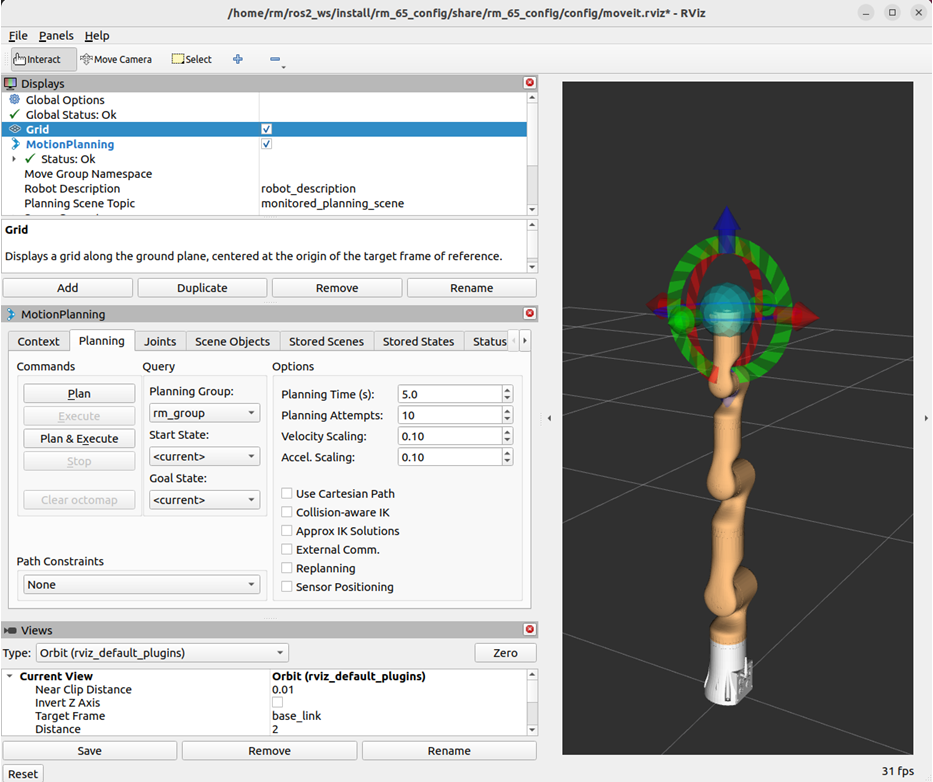
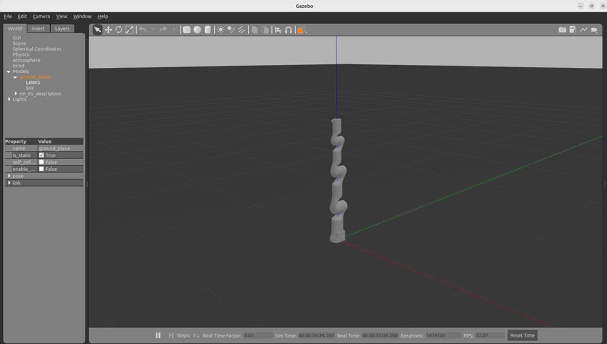
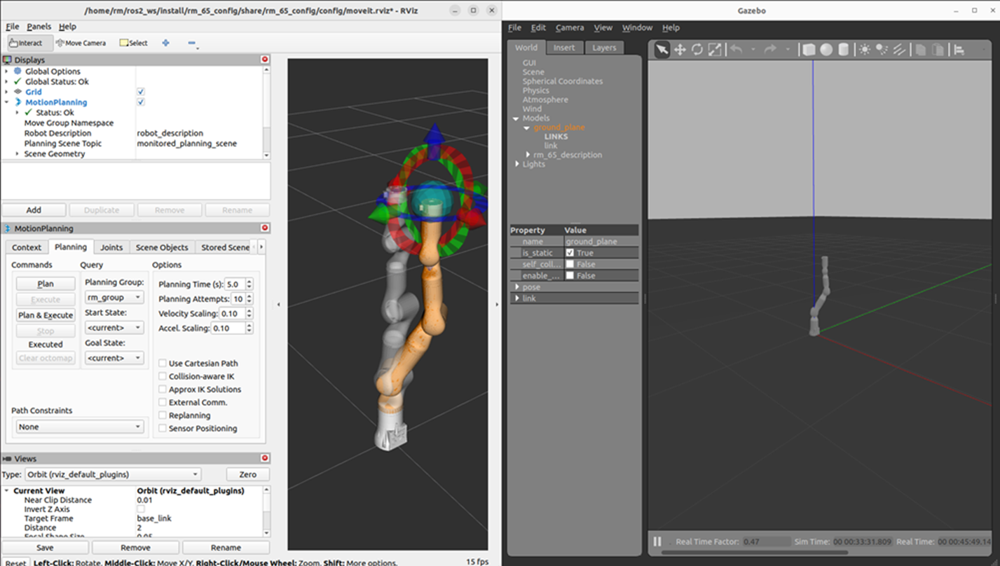

<div align="right">
 
[简体中文](https://github.com/RealManRobot/ros2_rm_robot/blob/main/rm_bringup/README_CN.md)|[English](https://github.com/RealManRobot/ros2_rm_robot/blob/main/rm_bringup/README.md)

</div>

<div align="center">

# 睿尔曼机器人rm_gazebo使用说明书V1.0
 
睿尔曼智能科技（北京）有限公司 
文件修订记录：

| 版本号| 时间   | 备注  | 
| :---: | :-----: | :---: |
|V1.0    |2024-2-19  |拟制 |

</div>

## 目录
* 1.[rm_bringup功能包说明](#rm_bringup功能包说明)
* 2.[rm_bringup功能包使用](#rm_bringup功能包使用)
* 2.1[moveit2控制真实机械臂](#moveit2控制真实机械臂)
* 2.2[控制gazebo仿真机械臂](#控制gazebo仿真机械臂)
* 3.[rm_bringup功能包架构说明](#rm_bringup功能包架构说明)
* 3.1[功能包文件总览](#rm_bringup功能包架构说明)
* 4.[rm_bringup话题说明](#rm_bringup话题说明)

## rm_bringup功能包说明
rm_bringup功能包为实现多个launch文件同时运行所设计的功能包，使用该功能包可用一条命令实现多个节点结合的复杂功能的启动。
* 1.功能包使用。
* 2.功能包架构说明。
* 3.功能包话题说明。  
通过这三部分内容的介绍可以帮助大家：
* 1.了解该功能包的使用。
* 2.熟悉功能包中的文件构成及作用。
* 3.熟悉功能包相关的话题，方便开发和使用
## rm_bringup功能包使用
### moveit2控制真实机械臂
首先配置好环境完成连接后我们可以通过以下命令直接启动节点，运行rm_bringup功能包中的launch.py文件。
```
rm@rm-desktop:~$ ros2 launch rm_bringup rm_<arm_type>_bringup.launch.py
```
在实际使用时需要将以上的<arm_type>更换为实际的机械臂型号，可选择的机械臂型号有65、63、eco65、75。
例如65机械臂的启动命令：
```
rm@rm-desktop:~$ ros2 launch rm_bringup rm_65_bringup.launch.py
```
节点启动成功后，将弹出以下画面。
  
实际该launch文件启动的为moveit2控制真实机械臂的功能下面就可以使用控制球规划控制机械臂运动，详细可查看《[rm_moveit2_config详解]((https://github.com/kaola-zero/ros2_rm_robot/blob/main/rm_moveit2_config/README_CN.md))》相关内容。
### 控制gazebo仿真机械臂
我们可以通过以下命令运行rm_bringup功能包中的launch.py文件，直接启动其中的gzaebo仿真节点。
```
rm@rm-desktop:~$ ros2 launch rm_bringup rm_<arm_type>_gazebo.launch.py
```
在实际使用时需要将以上的<arm_type>更换为实际的机械臂型号，可选择的机械臂型号有65、63、eco65、75。  
例如65机械臂的启动命令：
```
rm@rm-desktop:~$ ros2 launch rm_bringup rm_65_gazebo.launch.py
```
节点启动成功后，将弹出以下画面。
  
之后我们使用如下指令启动moveit2控制gazebo中的仿真机械臂。

## rm_bringup功能包架构说明
### 功能包文件总览
当前rm_driver功能包的文件构成如下。
```
├── CMakeLists.txt                      #编译规则文件
├── include
│   └── rm_bringup
├── launch
│   ├── rm_63_bringup.launch.py         #63臂moveit2启动文件
│   ├── rm_63_gazebo.launch.py          #63臂gazebo启动文件
│   ├── rm_65_bringup.launch.py         #65臂moveit2启动文件
│   ├── rm_65_gazebo.launch.py          #65臂gazebo启动文件
│   ├── rm_75_bringup.launch.py         #75臂moveit2启动文件
│   ├── rm_75_gazebo.launch.py          #75臂gazebo启动文件
│   ├── rm_eco65_bringup.launch.py      #eco65臂moveit2启动文件
│   └── rm_eco65_gazebo.launch.py       #eco65臂gazebo启动文件
├── package.xml
└── src
```
## rm_bringup话题说明
该功能包当前并没有本身的话题，主要为调用其他功能包的话题实现，关于moveit2相关话题可查看《[rm_moveit2_config详解](https://github.com/kaola-zero/ros2_rm_robot/blob/main/rm_moveit2_config/README_CN.md)》相关内容。
