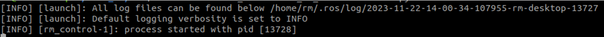
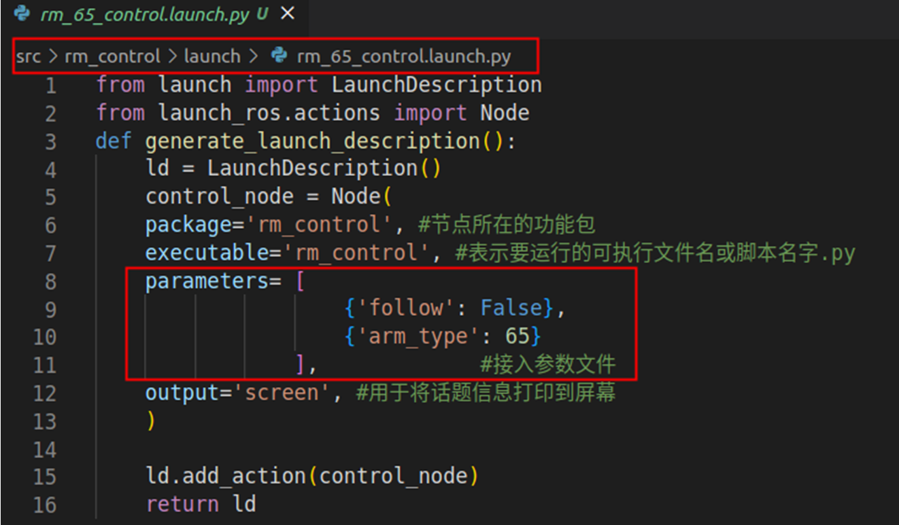

<div align="right">

[简体中文](https://github.com/RealManRobot/ros2_rm_robot/blob/main/rm_control/README_CN.md)|[English](https://github.com/RealManRobot/ros2_rm_robot/blob/main/rm_control/README.md)
 
</div>

<div align="center">

# RealMan Robotrm_controlUser Manual V1.0

RealMan Intelligent Technology (Beijing) Co., Ltd. 

Revision History:

|No.	  | Date   |	Comment |
| :---: | :----: | :---:   |
|V1.0	  | 2/19/2024 | Draft |

</div>

## Content
* 1.[rm_control Package Description](#rm_control_Package_Description)
* 2.[rm_control Package Function](#rm_control_Package_Function)
* 2.1[Basic use of the package](#Basic_use_of_the_package)
* 2.2[Advanced use of the package](#Advanced_use_of_the_package)
* 3.[rm_control Package Architecture Description](#rm_control_Package_Architecture_Description)
* 3.1[Overview of Package Files](#Overview_of_Package_Files)
* 4.[rm_control Topic Description](#rm_control_Topic_Description)

## rm_control_Package_Description
rm_control is a function package for realizing the moveit2 control of a real robotic arm. The package is mainly used to further subdivide the path points planned by moveit2, and give the subdivided path points to rm_driver in a through-transmission way to realize the planning and running of the robotic arm. This package is introduced in detail in the following aspects.
* 1.Package use.
* 2.Package architecture description.
* 3.Package topic description.
Through the introduction of the three parts, it can help you:
* 1.Understand the package use.
* 2.Familiar with the file structure and function of the package.
* 3.Familiar with the topic related to the package for easy development and use.
Source code address: https://github.com/RealManRobot/ros2_rm_robot.git。
## rm_control_Package_Function
### Basic_use_of_the_package
First, after configuring the environment and completing the connection, we can directly start the node and run the rm_control package.
```
rm@rm-desktop:~$ ros2 launch  rm_control rm_<arm_type>_control.launch.py
```
In practice, the above <arm_type> needs to be replaced by the actual model of the robotic arm. The available models of the robotic arm are 65, 63, eco65, and 75.  
For example, the launch command of 65 robotic arm:
```
rm@rm-desktop:~$ ros2 launch  rm_control rm_65_control.launch.py
```
The following screen appears in the interface after successful node startup.

It does not play a role when the node of the package is launched alone. It needs to be combined with the rm_driver package and the relevant nodes of moveit2 to play a role. For details, please refer to the relevant content of "rm_moveit2_config Detailed Description".
### Advanced_use_of_the_package
Some parameters can be configured in the rm_control package. Because there are not many parameters, the parameters are directly configured in the launch file.

As shown in the figure above, the position of the first red box is the file path, and the position of the second box is the current configurable parameter.  
Parameter follows: represents the following mode used by the current transmission, where true is high following and false is low following. The high following indicates that the robotic arm's movement mode is consistent with the transmission. It must do detailed calculations based on its transmission rate, speed, and acceleration. The threshold is set too high, but the control is fine. The low following indicates that the robotic arm moves to the transmission point based on its transmission rate, speed, and acceleration. If there are points that cannot be reached in time, there may be abandonment. The threshold is set low, and the control is not very fine but meets the use.  
Parameter arm_type: represents the current model of the robotic arm. The parameters that can be selected are 65 (65 series), 651 (eco65), 632 (63 series), and 75 (75 series).  
In practice, we choose the corresponding launch file to start, which will automatically select the correct model. If there are special requirements, you can modify the corresponding parameters here. After modification, recompile the configuration in the workspace directory, and then the modified configuration will take effect.  
Run colcon build command in the workspace directory.  
```
rm@rm-desktop: ~/ros2_ws$ colcon build
```
After successful compilation, follow the above commands to start the package.
## rm_control_Package_Architecture_Description
### Overview_of_package_files
The current rm_driver package is composed of the following files.
```
├── CMakeLists.txt                     # compilation rule file
├── include                            # dependency header file folder
│   ├── cubicSpline.h                  # cubic spline interpolation header file
│   └── rm_control.h                   #rm_control header file
├── launch
│   ├── rm_63_control.launch.py        # 63 launch file
│   ├── rm_65_control.launch.py        # 65 launch file
│   ├── rm_75_control.launch.py        # 75 launch file
│   └── rm_eco65_control.launch.py     # eco65 launch file
├── package.xml                        # dependency declaration file
└── src
    └── rm_control.cpp                 # code source file
```
## rm_control_Topic_Description
The following is the topic description of the package.
```
  Subscribers:
    /parameter_events: rcl_interfaces/msg/ParameterEvent
  Publishers:
    /parameter_events: rcl_interfaces/msg/ParameterEvent
    /rm_driver/movej_canfd_cmd: rm_ros_interfaces/msg/Jointpos
    /rosout: rcl_interfaces/msg/Log
  Service Servers:
    /rm_control/describe_parameters: rcl_interfaces/srv/DescribeParameters
    /rm_control/get_parameter_types: rcl_interfaces/srv/GetParameterTypes
    /rm_control/get_parameters: rcl_interfaces/srv/GetParameters
    /rm_control/list_parameters: rcl_interfaces/srv/ListParameters
    /rm_control/set_parameters: rcl_interfaces/srv/SetParameters
    /rm_control/set_parameters_atomically: rcl_interfaces/srv/SetParametersAtomically
  Service Clients:

  Action Servers:
    /rm_group_controller/follow_joint_trajectory: control_msgs/action/FollowJointTrajectory
  Action Clients:
```
We mainly focus on the following topics.  
Publishers: represents its current published topic, the most important published topic is /rm_driver/movej_canfd_cmd, through which we publish the subdivided points to rm_driver node, and then rm_driver node gives the corresponding path to the robotic arm through the transmission way.  
Action Servers: represents the action information it receives and publishes, /rm_group controller/follow_joint_trajectory action as the bridge of communication between rm_control and moveit2, through which rm_control receives the path planned by moveit2, and rm_control further subdivides these paths from the above topic to rm_driver.  
There are relatively few remaining topics and service use scenarios, so we do not introduce them in detail here, and you can learn by yourself.
