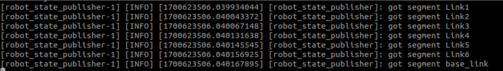
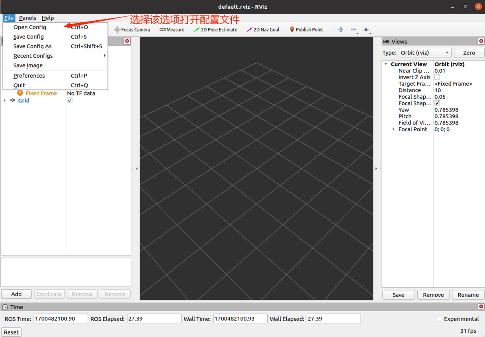
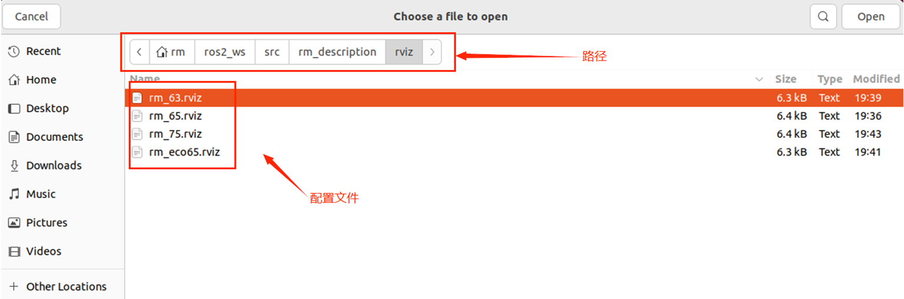

<div align="right">

[简体中文](https://github.com/RealManRobot/ros2_rm_robot/blob/main/rm_description/README_CN.md)|[English](https://github.com/RealManRobot/ros2_rm_robot/blob/main/rm_description/README.md)
 
</div>

<div align="center">

# RealMan Robot rm_description User Manual V1.0

RealMan Intelligent Technology (Beijing) Co., Ltd. 

Revision History:

|No.	  | Date   |	Comment |
| :---: | :----: | :---:   |
|V1.0	  | 2/19/2024 | Draft |

</div>

## Content
* 1.[rm_description Package Description](#rm_description_Package_Description)
* 2.[rm_description Package Use](#rm_description_Package_Use)
* 3.[rm_description Package Architecture Description](#rm_description_Package_Architecture_Description)
* 3.1[Overview of Package Files](#Overview_of_Package_Files)
* 4.[rm_description Topic Description](#rm_description_Topic_Description)

## rm_description_Package_Description
rm_description is a function package for displaying the robot model and TF transformation. Through this package, we can realize the linkage effect between a virtual robotic arm in a computer and a real robot arm in reality. In the moveit2 control, we also need the support of this package. This package is introduced in detail in the following aspects.  
* 1.Package use.
* 2.Package architecture description.
* 3.Package topic description.
Through the introduction of the three parts, it can help you:
* 1.Understand the package use.
* 2.Familiar with the file structure and function of the package.
* 3.Familiar with the topic related to the package for easy development and use.
Source code address:https://github.com/RealManRobot/ros2_rm_robot.git.
## rm_description_Package_Use
First, after configuring the environment and completing the connection, we can directly start the node and run the rm_description package.
```
rm@rm-desktop:~$ ros2 launch rm_description rm_<arm_type>_display.launch.py
```
In practice, the above <arm_type> needs to be replaced by the actual model of the robotic arm. The available models of the robotic arm are 65, 63, eco65, and 75.  
For example, the launch command of 65 robotic arm:  
```
rm@rm-desktop:~$ ros2 launch rm_description rm_65_display.launch.py
```
The following screen appears in the interface after successful node startup.  

Then we need to launch the rm_driver node.  
```
rm@rm-desktop:~$ ros2 launch rm_driver rm_<arm_type>_driver.launch.py
```
After a successful launch, we can check the state of the robotic arm in rviz2. Run the following command to launch rviz2.  
```
rm@rm-desktop:~$ rviz2
```
Open the robot model with the following configuration.  
  
Find the corresponding configuration file under the rviz folder of the rm_description package.  

After loading, you can see the current state of the robotic arm in the interface of rviz2.  

## rm_description_Package_Architecture_Description
### Overview_of_package_files
The current rm_driver package is composed of the following files.  
```
├── CMakeLists.txt                # compilation rule file
├── launch
│   ├── rm_63_display.launch.py     # 63 launch file
│   ├── rm_65_display.launch.py     # 65 launch file
│   ├── rm_75_display.launch.py     # 75 launch file
│   └── rm_eco65_display.launch.py  # eco65 launch file
├── meshes                       # model file storage folder
│   ├── rm_63_arm                 #63 robotic arm model file storage folder
│   │   ├── base_link.STL
│   │   ├── link1.STL
│   │   ├── link2.STL
│   │   ├── link3.STL
│   │   ├── link4.STL
│   │   ├── link5.STL
│   │   └── link6.STL
│   ├── rm_65_arm                 #65 robotic arm model file storage folder
│   │   ├── base_link.STL
│   │   ├── link1.STL
│   │   ├── link2.STL
│   │   ├── link3.STL
│   │   ├── link4.STL
│   │   ├── link5.STL
│   │   └── link6.STL
│   ├── rm_75_arm                 #75 robotic arm model file storage folder
│   │   ├── base_link.STL
│   │   ├── link1.STL
│   │   ├── link2.STL
│   │   ├── link3.STL
│   │   ├── link4.STL
│   │   ├── link5.STL
│   │   ├── link6.STL
│   │   └── link7.STL
│   └── rm_eco65_arm                 #eco65 robotic arm model file storage folder
│       ├── baselink.STL
│       ├── Link1.STL
│       ├── Link2.STL
│       ├── Link3.STL
│       ├── Link4.STL
│       ├── Link5.STL
│       └── Link6.STL
├── package.xml
├── rviz                               #rviz2 configuration file storage folder
│   ├── rm_63.rviz
│   ├── rm_65.rviz
│   ├── rm_75.rviz
│   └── rm_eco65.rviz
├── textures
└── urdf
    ├── display_arm.rviz
    ├── rm_65_description.csv
    ├── rm_65_gazebo.urdf               #65gazebo simulation urdf description file
    ├── rm_65.urdf                      #65 urdf description file
    ├── rm_75_description.csv
    ├── rm_75_gazebo.urdf               #75gazebo simulation urdf description file
    ├── rm_75.urdf                      #75 urdf description file
    ├── rm_eco65.csv
    ├── rm_eco65_gazebo.urdf           #eco65gazebo simulation urdf description file
    ├── rm_eco65.urdf                   #eco65 urdf description file
    ├── rml_63_description.csv
    ├── rml_63_gazebo.urdf               #63gazebo simulation urdf description file
    └── rml_63.urdf                      #63 urdf description file
```
## rm_description_Topic_Description
The following is the topic description of the package.  
```
  Subscribers:
    /joint_states: sensor_msgs/msg/JointState
    /parameter_events: rcl_interfaces/msg/ParameterEvent
  Publishers:
    /parameter_events: rcl_interfaces/msg/ParameterEvent
    /robot_description: std_msgs/msg/String
    /rosout: rcl_interfaces/msg/Log
    /tf: tf2_msgs/msg/TFMessage
    /tf_static: tf2_msgs/msg/TFMessage
  Service Servers:
    /robot_state_publisher/describe_parameters: rcl_interfaces/srv/DescribeParameters
    /robot_state_publisher/get_parameter_types: rcl_interfaces/srv/GetParameterTypes
    /robot_state_publisher/get_parameters: rcl_interfaces/srv/GetParameters
    /robot_state_publisher/list_parameters: rcl_interfaces/srv/ListParameters
    /robot_state_publisher/set_parameters: rcl_interfaces/srv/SetParameters
    /robot_state_publisher/set_parameters_atomically: rcl_interfaces/srv/SetParametersAtomically
  Service Clients:

  Action Servers:

  Action Clients:
```
We mainly focus on the following topics.  
Subscribers: represents the topics it subscribes to, where /joint_states represents the current state of the robotic arm, which is published by our rm_driver package when running so that the model in rviz moves according to the actual state of the robotic arm.  
Publishers: represents the topics it currently publishes, where the most important published topics are /tf and /tf_static, which describe the coordinate transformation relationship between the joints of the robotic arm, namely TF transformation.  
There are relatively few remaining topics and service use scenarios and you can learn by yourself.
