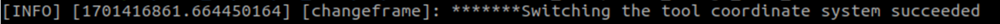
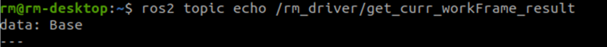
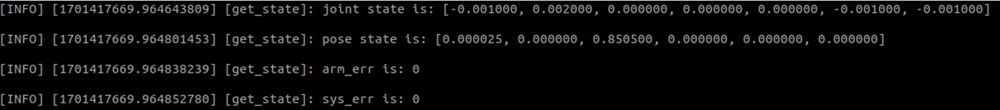
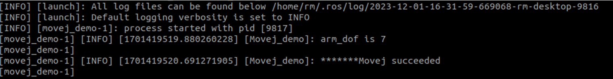
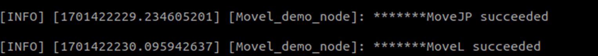
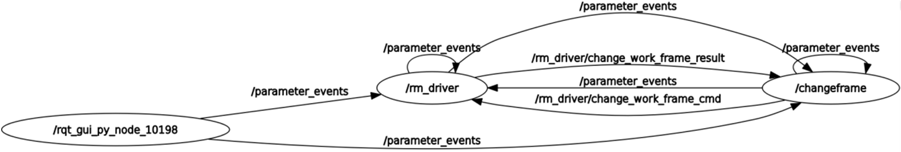
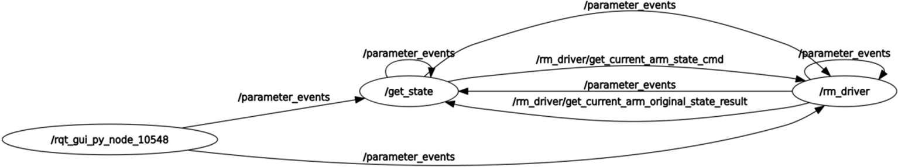
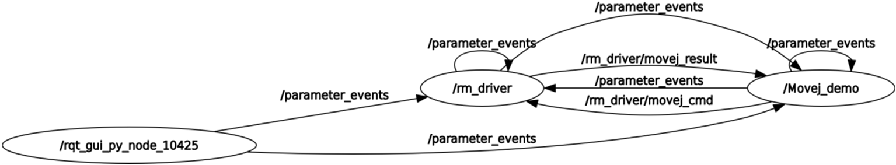
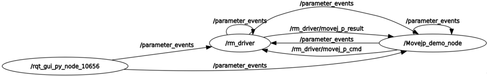
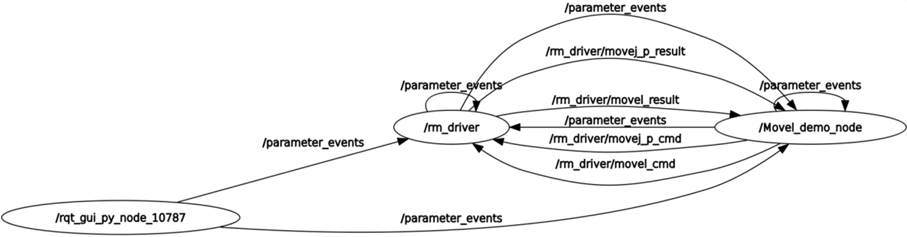

<div align="right">
 
[简体中文](https://github.com/RealManRobot/ros2_rm_robot/blob/main/rm_example/README_CN.md)|[English](https://github.com/RealManRobot/ros2_rm_robot/blob/main/rm_example/README.md)

</div>

<div align="center">

# 睿尔曼机器人rm_example使用说明书V1.0
 
睿尔曼智能科技（北京）有限公司 
文件修订记录：

| 版本号| 时间   | 备注  | 
| :---: | :-----: | :---: |
|V1.0    |2024-2-19  |拟制 |

</div>

## 目录
* 1.[rm_example功能包说明](#rm_example功能包说明)
* 2.[rm_example功能包使用](#rm_example功能包使用)
* 2.1[更换工作坐标系](#更换工作坐标系)
* 2.2[得到当前的机械臂状态信息](#得到当前的机械臂状态信息)
* 2.3[机械臂MoveJ运动](#机械臂MoveJ运动)
* 2.4[机械臂MoveJ_P运动](#机械臂MoveJ_P运动)
* 2.5[机械臂MoveL运动](#机械臂MoveL运动)
* 3.[rm_example功能包架构说明](#rm_example功能包架构说明)
* 3.1[功能包文件总览](#功能包文件总览)
* 4.[rm_example话题说明](#rm_example话题说明)
* 4.1[rm_change_work_frame话题说明](#rm_change_work_frame话题说明)
* 4.2[rm_get_state话题说明](#rm_get_state话题说明)
* 4.3[movej_demo话题说明](#movej_demo话题说明)
* 4.4[movejp_demo话题说明](#movejp_demo话题说明)
* 4.5[movel_demo话题说明](#movel_demo话题说明)

## rm_example功能包说明
rm_bringup功能包为实现了一些基本的机械臂功能，通过该功能包我们可以实现机械臂的一些基本的控制功能，还可以参考代码，实现其他的机械臂功能。
* 1.功能包使用。
* 2.功能包架构说明。
* 3.功能包话题说明。  
通过这三部分内容的介绍可以帮助大家：
* 1.了解该功能包的使用。
* 2.熟悉功能包中的文件构成及作用。
* 3.熟悉功能包相关的话题，方便开发和使用
## rm_example功能包使用
### 更换工作坐标系
首先需要运行机械臂的底层驱动节点rm_driver。
```
rm@rm-desktop:~$ ros2 launch rm_driver rm_<arm_type>_driver.launch.py
```
在实际使用时需要将以上的<arm_type>更换为实际的机械臂型号，可选择的机械臂型号有65、63、eco65、75。  
例如65机械臂的启动命令：
```
rm@rm-desktop:~$ ros2 launch rm_driver rm_65_driver.launch.py
```
节点启动成功后，需要执行如下指令运行我们更换工作坐标系的节点。
```
rm@rm-desktop:~$ ros2 run rm_example rm_change_work_frame
```
弹出以下指令代表更换成功。

可以在终端中输入如下指令进行验证，首先订阅当前的工作坐标系话题。
```
rm@rm-desktop:~$ ros2 topic echo /rm_driver/get_curr_workFrame_result
```
之后发布当前坐标系的请求。
```
rm@rm-desktop:~$ ros2 topic pub --once /rm_driver/get_curr_workFrame_cmd std_msgs/msg/Empty "{}"
```
可以看到终端中弹出如下界面。

### 得到当前的机械臂状态信息
首先需要运行机械臂的底层驱动节点rm_driver。
```
rm@rm-desktop:~$ ros2 launch rm_driver rm_<arm_type>_driver.launch.py
```
在实际使用时需要将以上的<arm_type>更换为实际的机械臂型号，可选择的机械臂型号有65、63、eco65、75。  
例如65机械臂的启动命令：
```
rm@rm-desktop:~$ ros2 launch rm_driver rm_65_driver.launch.py
```
节点启动成功后，需要执行如下指令运行获得机械臂当前状态的节点。
```
rm@rm-desktop:~$ ros2 run rm_example rm_get_state
```
弹出以下指令代表更换成功。

界面中现实的为机械臂当前的角度信息，以及机械臂当前的末端坐标位置和欧拉角姿态信息。
### 机械臂MoveJ运动
通过如下指令可以控制机械臂进行MoveJ关节运动。
首先需要运行机械臂的底层驱动节点rm_driver。
```
rm@rm-desktop:~$ ros2 launch rm_driver rm_<arm_type>_driver.launch.py
```
在实际使用时需要将以上的<arm_type>更换为实际的机械臂型号，可选择的机械臂型号有65、63、eco65、75。  
例如65机械臂的启动命令：
```
rm@rm-desktop:~$ ros2 launch rm_driver rm_65_driver.launch.py
```
节点启动成功后，需要执行如下指令控制机械臂进行运动。
```
rm@rm-desktop:~$ ros2 launch rm_example rm_<dof>_movej.launch.py
```
命令中的dof代表机械当前的自由度信息，可以选的参数有6dof和7dof。  
例如启动7轴的机械臂时需要使用如下指令。
```
rm@rm-desktop:~$ ros2 launch rm_example rm_7dof_movej.launch.py
```
运行成功后，机械臂的关节将发生转动，且界面将显示如下信息。

### 机械臂MoveJ_P运动
通过如下指令可以控制机械臂进行MoveJ_P关节运动。  
首先需要运行机械臂的底层驱动节点rm_driver。
```
rm@rm-desktop:~$ ros2 launch rm_driver rm_<arm_type>_driver.launch.py
```
在实际使用时需要将以上的<arm_type>更换为实际的机械臂型号，可选择的机械臂型号有65、63、eco65、75。  
例如65机械臂的启动命令：
```
rm@rm-desktop:~$ ros2 launch rm_driver rm_65_driver.launch.py
```
节点启动成功后，需要执行如下指令控制机械臂进行运动。
```
rm@rm-desktop:~$ ros2 run rm_example movejp_demo
```
执行成功后界面将出现如下提示，并且机械臂运动到指定位姿。

### 机械臂MoveL运动
通过如下指令可以控制机械臂进行MoveL关节运动。
首先需要运行机械臂的底层驱动节点rm_driver。
```
rm@rm-desktop:~$ ros2 launch rm_driver rm_<arm_type>_driver.launch.py
```
在实际使用时需要将以上的<arm_type>更换为实际的机械臂型号，可选择的机械臂型号有65、63、eco65、75。  
例如65机械臂的启动命令：
```
rm@rm-desktop:~$ ros2 launch rm_driver rm_65_driver.launch.py
```
节点启动成功后，需要执行如下指令控制机械臂进行运动。
```
rm@rm-desktop:~$ ros2 run rm_example movel_demo
```
执行成功后界面将出现如下提示，并且机械臂将进行两次运动，首先通过MoveJP运动到指定位姿，之后通过MoveL进行关节运动。


## rm_example功能包架构说明
### 功能包文件总览
当前rm_driver功能包的文件构成如下。
├── CMakeLists.txt                             #编译规则文件
├── include
│   └── rm_example
├── launch
│   ├── rm_6dof_movej.launch.py                 #6自由度MoveJ运动启动文件
│   └── rm_7dof_movej.launch.py                 #7自由度MoveJ运动启动文件
├── package.xml
└── src
    ├── api_ChangeWorkFrame_demo.cpp        #更换工作坐标系源文件
    ├── api_Get_Arm_State_demo.cpp            #获得机械臂状态源文件
    ├── api_MoveJ_demo.cpp                    #MoveJ运动源文件
    ├── api_MoveJP_demo.cpp                  #MoveJP运动源文件
    └── api_MoveL_demo.cpp                   #MoveL运动源文件
## rm_example话题说明
### rm_change_work_frame话题说明
以下为该节点的数据通信图：

可以看到/changeframe节点和/rm_driver之间的主要通信话题为/rm_driver/change_work_frame_result和/rm_driver/change_work_frame_cmd。/rm_driver/change_work_frame_cmd为切换请求和切换目标坐标的发布，/rm_driver/change_work_frame_result为切换结果。
### rm_get_state话题说明
以下为该节点的数据通信图：

可以看到/get_state节点和/rm_driver之间的主要通信话题为/rm_driver/get_current_arm_state_cmd和/rm_driver/get_current_arm_original_state_result。/rm_driver/get_current_arm_state_cmd为获取机械臂当前状态请求，/rm_driver/get_current_arm_original_state_result为切换结果。
### movej_demo话题说明
以下为该节点的数据通信图：

可以看到/Movej_demo节点和/rm_driver之间的主要通信话题为/rm_driver/movej_cmd和/rm_driver/movej_result。/rm_driver/movej_cmd为控制机械臂运动的请求，将发布需要运动到的各关节的弧度信息，/rm_driver/ movej_result为运动结果。
### movejp_demo话题说明
以下为该节点的数据通信图：

可以看到/Movejp_demo_node节点和/rm_driver之间的主要通信话题为/rm_driver/movej_p_cmd和/rm_driver/movej_p_result。/rm_driver/movej_p_cmd为控制机械臂运动规划的请求，将发布需要运动到的目标点的坐标，/rm_driver/ movej_p_result为运动结果。
### movel_demo话题说明
以下为该节点的数据通信图：

可以看到/Movel_demo_node节点和/rm_driver之间的主要通信话题为/rm_driver/movej_p_cmd和/rm_driver/movej_p_result还有/rm_driver/movel_cmd和/rm_driver/movel_result。/rm_driver/movej_p_cmd为控制机械臂运动规划的请求，将发布机械臂首先需要运动到的目标点的坐标， /rm_driver/ movej_p_result为运动结果，到达第一个点位后我们通过直线运动到达第二个点位，就可以通过/rm_driver/movel_cmd发布第二个点位的位姿，/rm_driver/movel_result话题代表运动的结果。

