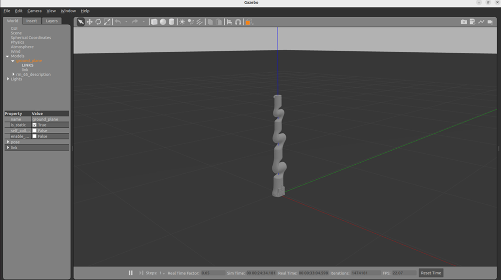
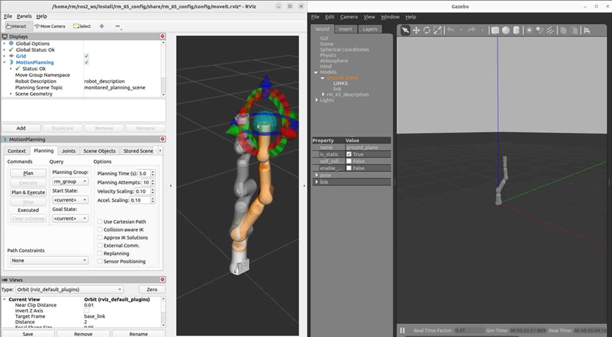

<div align="right">
 
[简体中文](https://github.com/RealManRobot/ros2_rm_robot/blob/humble1.1.0/rm_gazebo/README_CN.md)|[English](https://github.com/RealManRobot/ros2_rm_robot/blob/humble1.1.0/rm_gazebo/README.md)

</div>

<div align="center">

# 睿尔曼机器人rm_gazebo使用说明书V1.1
 
睿尔曼智能科技（北京）有限公司 
文件修订记录：

| 版本号| 时间   | 备注  | 
| :---: | :-----: | :---: |
|V1.0    |2024-2-19  |拟制 |
|V1.1    |2024-7-8   |修订（添加gen72相关适配文件） |

</div>

## 目录
* 1.[rm_gazebo功能包说明](#rm_gazebo功能包说明)
* 2.[rm_gazebo功能包运行](#rm_gazebo功能包运行)
* 2.1[控制仿真机械臂](#控制仿真机械臂)
* 3.[rm_gazebo功能包架构说明](#rm_gazebo功能包架构说明)
* 3.1[功能包文件总览](#功能包文件总览)

## rm_gazebo功能包说明
rm_gazebo的主要作用为帮助我们实现机械臂Moveit2规划的仿真功能，我们将在gazebo的仿真环境中搭建一个虚拟机械臂，然后通过Moveit2控制gazebo中的虚拟机械臂。
* 1.功能包使用。
* 2.功能包架构说明。
通过这三部分内容的介绍可以帮助大家：  
* 1.了解该功能包的使用。
* 2.熟悉功能包中的文件构成及作用。
### 控制仿真机械臂
在完成环境安装和功能包安装后，我们可以进行rm_gazebo功能包的运行。  
使用如下指令启动gazebo虚拟空间和虚拟机械臂。
```
rm@rm-desktop:~$ ros2 launch rm_gazebo gazebo_<arm_type>_demo.launch.py
```
在实际使用时需要将以上的<arm_type>更换为实际的机械臂型号，可选择的机械臂型号有65、63、eco65、75、gen72，运行成功后将弹出如下界面。  

之后我们使用如下指令启动moveit2控制gazebo中的仿真机械臂。
```
rm@rm-desktop:~$ ros2 launch rm_65_config gazebo_moveit_demo.launch.py
```
弹出rviz2的控制界面后就可以进行moveit2和gazebo的仿真控制了。

## rm_gazebo功能包架构说明
### 功能包文件总览
当前rm_gazebo功能包的文件构成如下。
```
├── CMakeLists.txt                           #编译规则文件
├── config
│   ├── gazebo_63_description.urdf.xacro     #RML63gazebo模型描述文件
│   ├── gazebo_65_description.urdf.xacro     #RM65gazebo模型描述文件
│   ├── gazebo_75_description.urdf.xacro     #RM75gazebo模型描述文件
│   ├── gazebo_eco65_description.urdf.xacro  #ECO65gazebo模型描述文件
│   └── gazebo_gen72_description.urdf.xacro  #GEN72gazebo模型描述文件
├── doc
│   ├── rm_gazebo1.png
│   └── rm_gazebo2.png
├── include
│   └── rm_gazebo
├── launch
│   ├── gazebo_63_demo.launch.py             #RML63gazebo启动文件
│   ├── gazebo_65_demo.launch.py             #RM65gazebo启动文件
│   ├── gazebo_75_demo.launch.py             #RM75gazebo启动文件
│   ├── gazebo_eco65_demo.launch.py          #ECO65gazebo启动文件
│   └── gazebo_gen72_demo.launch.py          #GEN72gazebo启动文件
├── package.xml
├── README_CN.md
└── README.md
```