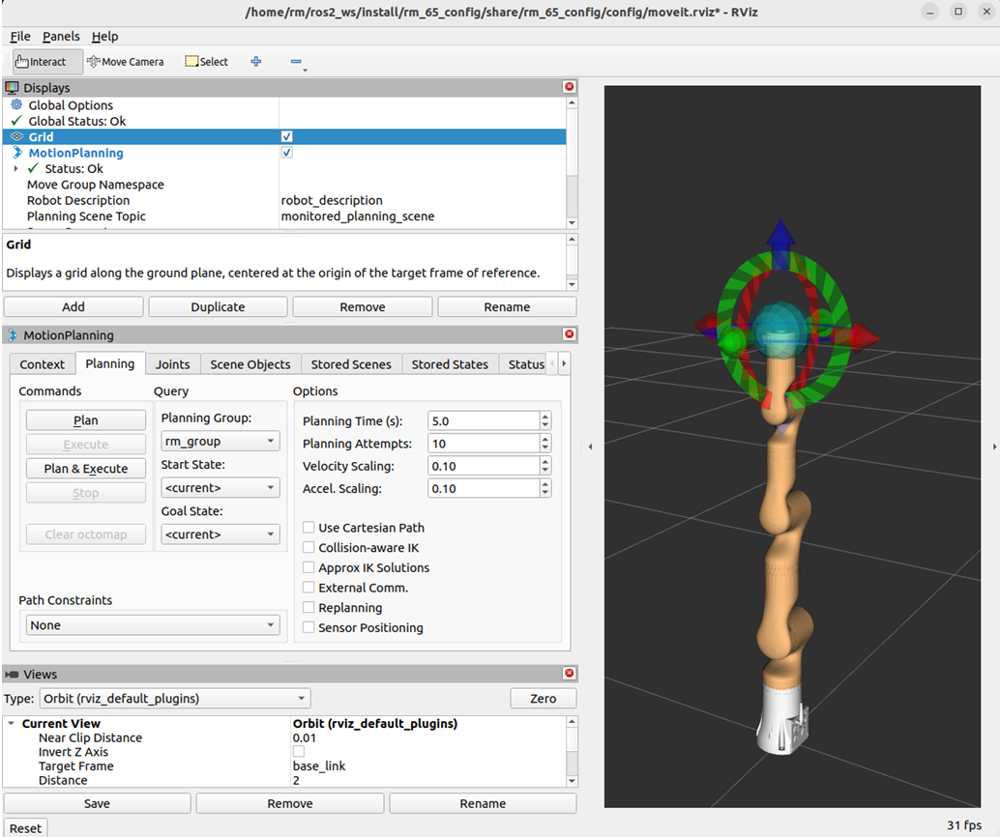
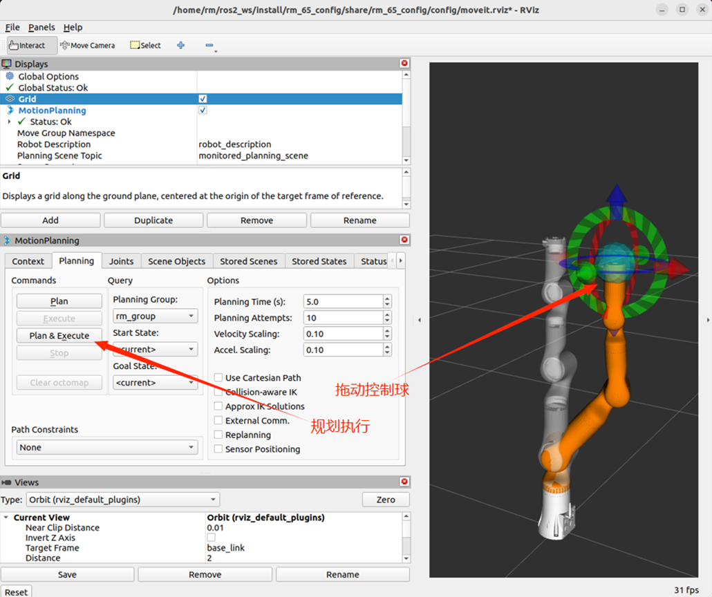
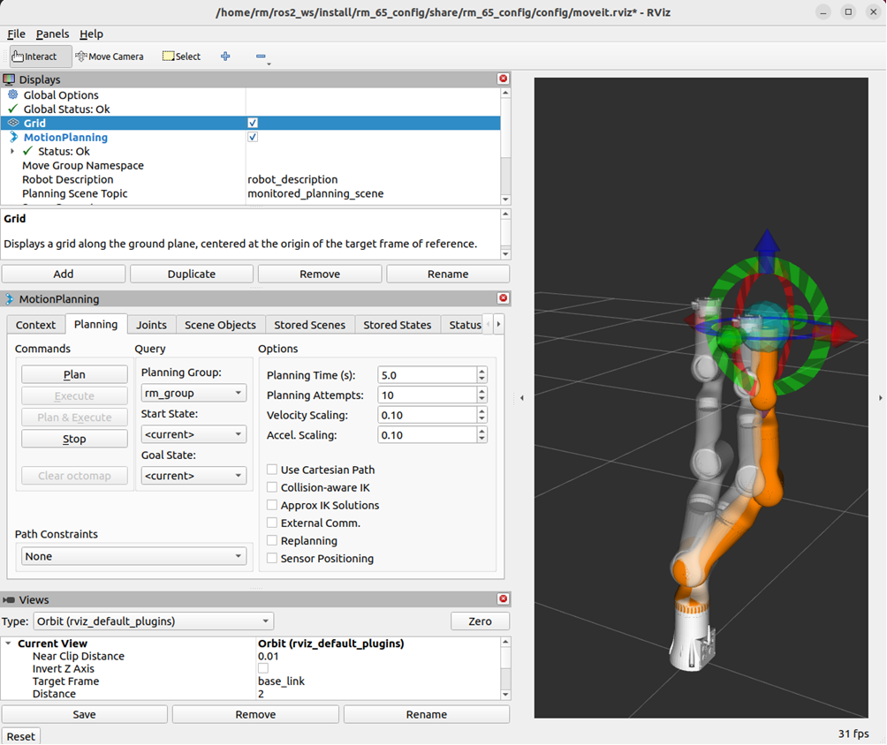
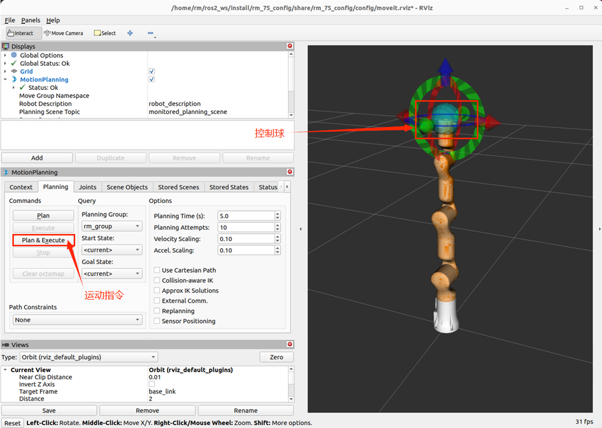
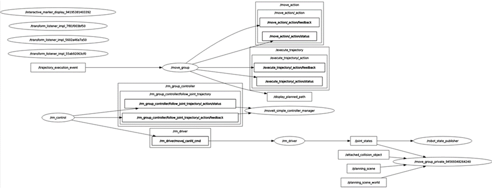
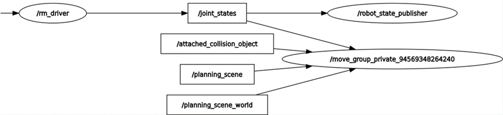
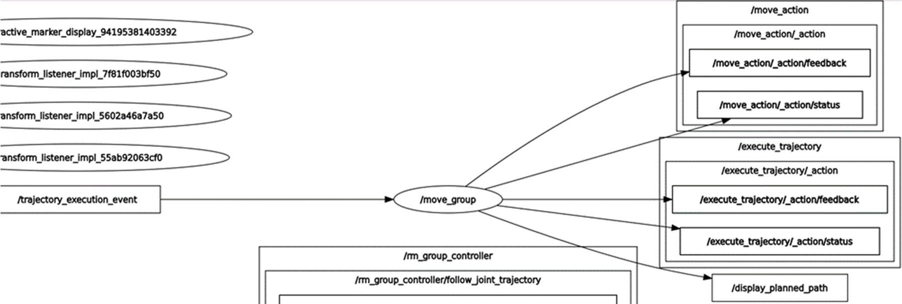

<div align="right">

[简体中文](https://github.com/RealManRobot/ros2_rm_robot/blob/main/rm_moveit2_config/README_CN.md)|[English](https://github.com/RealManRobot/ros2_rm_robot/blob/main/rm_moveit2_config/README.md)
 
</div>

<div align="center">

# RealMan Robotic Arm rm_moveit2_config User Manual V1.0

RealMan Intelligent Technology (Beijing) Co., Ltd. 

Revision History:

|No.	  | Date   |	Comment |
| :---: | :----: | :---:   |
|V1.0	  | 2/19/2024 | Draft |

</div>

## Content
* 1.[rm_moveit2_config Description](#rm_moveit2_config_Description)
* 2.[rm_moveit2_config Use](#rm_moveit2_config_Use)
* 2.1[moveit2 Controlling Virtual Robotic Arm](#moveit2_Controlling_Virtual_Robotic_Arm)
* 2.2[moveit2 Controlling Real Robotic Arm](#moveit2_Controlling_Real_Robotic_Arm)
* 3.[rm_moveit2_config Architecture Description](#rm_moveit2_config_Architecture_Description)
* 3.1[Overview of Package Files](#Overview_of_Package_Files)
* 4.[rm_moveit2_config Topic Description](#rm_moveit2_config_Topic_Description)


 
## rm_moveit2_config_Description
rm_moveit2_config folder is a function package for realizing the moveit2 control of a real robotic arm. The package is mainly used to call the official moveit2 framework and generate the configuration and launch file of moveit2 suitable for our robotic arm combined with the URDF of the robotic arm. Through this package, we can realize the moveit2 control of the virtual robotic arm and control of the real robotic arm. This package is introduced in detail in the following aspects.
* 1.Package use.
* 2.Package architecture description.
* 3.Package topic description.
Through the introduction of the three parts, it can help you:
* 1.Understand the package use.
* 2.Familiar with the file structure and function of the package.
* 3.Familiar with the topic related to the package for easy development and use.
Source code address: https://github.com/RealManRobot/ros2_rm_robot.git。
## rm_moveit2_config_Use
### moveit2_Controlling_Virtual_Robotic_Arm
First, after configuring the environment and completing the connection, we can directly launch the node through the following command.
rm@rm-desktop:~$ ros2 launch rm_<arm_type>_config demo.launch.py
In practice, the above <arm_type> needs to be replaced by the actual model of the robotic arm. The available models of the robotic arm are 65, 63, eco65, and 75.  
For example, the launch command of 65 robotic arm:
```
rm@rm-desktop:~$ ros2 launch rm_65_config demo.launch.py
```
The following screen appears in the interface after successful node startup.  

Next, we can make the robotic arm reach the target position by dragging the control ball and then clicking Plan Execution.

Execute the plan.

### moveit2_Controlling_Real_Robotic_Arm
There are relatively more control commands required to control a real robotic arm, and the following is a detailed control method.  
First, run the chassis driver node.  
```
rm@rm-desktop:~$ ros2 launch rm_driver rm_<arm_type>_driver.launch.py
```
Next, run the rm_description package file.
```
rm@rm-desktop:~$ ros2 launch rm_description rm_<arm_type>_display.launch.py
```
Then, run the relevant nodes of the intermediate package rm_control.
```
rm@rm-desktop:~$ ros2 launch rm_control rm_<arm_type>_control.launch.py
```
Finally, launch the moveit2 node that controls the real robotic arm.
```
rm@rm-desktop:~$ ros2 launch rm_<arm_type>_config real_moveit_demo.launch.py
```
Note that the above commands need to replace <arm_type> with the corresponding robotic arm model, which can be selected as 65, 63, eco65, and 75.  
After completing the above operations, the following interface appears, and we can control the movement of the robotic arm by dragging the control ball.  

## rm_moveit2_config_Architecture_Description
### Overview_of_package_files
The current rm_driver package is composed of the following files.
```
├── rm_63_config                                   #63 robotic arm moveit2 package
│   ├── CMakeLists.txt                             #63 robotic arm moveit2 package compilation rules
│   ├── config                                     #63 robotic arm moveit2 package parameter folder
│   │   ├── initial_positions.yaml                 #63 robotic arm moveit2 initial position
│   │   ├── joint_limits.yaml                      #63 robotic arm joint limits
│   │   ├── kinematics.yaml                        #63 robotic arm kinematics parameters
│   │   ├── moveit_controllers.yaml                #63 robotic arm moveit2 controller
│   │   ├── moveit.rviz                            #63 robotic arm rviz2 display configuration file
│   │   ├── pilz_cartesian_limits.yaml
│   │   ├── rml_63_description.ros2_control.xacro  #63 robotic arm xacro description file
│   │   ├── rml_63_description.srdf                #63 robotic arm moveit2 control configuration file
│   │   ├── rml_63_description.urdf.xacro          #63 robotic arm xacro description file
│   │   └── ros2_controllers.yaml                  #63 robotic arm move controller
│   ├── launch
│   │   ├── demo.launch.py                         #63 virtual robotic arm moveit2 launch file
│   │   ├── gazebo_moveit_demo.launch.py           #63 simulation robotic arm moveit2 launch file
│   │   ├── move_group.launch.py
│   │   ├── moveit_rviz.launch.py
│   │   ├── real_moveit_demo.launch.py             #63 real robotic arm moveit2 launch file
│   │   ├── rsp.launch.py
│   │   ├── setup_assistant.launch.py
│   │   ├── spawn_controllers.launch.py
│   │   ├── static_virtual_joint_tfs.launch.py
│   │   └── warehouse_db.launch.py
│   └── package.xml
├── rm_65_config                                   #65 robotic arm moveit2 package (file explanation reference 63)
│   ├── CMakeLists.txt
│   ├── config
│   │   ├── initial_positions.yaml
│   │   ├── joint_limits.yaml
│   │   ├── kinematics.yaml
│   │   ├── moveit_controllers.yaml
│   │   ├── moveit.rviz
│   │   ├── pilz_cartesian_limits.yaml
│   │   ├── rm_65_description.ros2_control.xacro
│   │   ├── rm_65_description.srdf
│   │   ├── rm_65_description.urdf.xacro
│   │   └── ros2_controllers.yaml
│   ├── launch
│   │   ├── demo.launch.py
│   │   ├── gazebo_moveit_demo.launch.py
│   │   ├── move_group.launch.py
│   │   ├── moveit_rviz.launch.py
│   │   ├── real_moveit_demo.launch.py
│   │   ├── rsp.launch.py
│   │   ├── setup_assistant.launch.py
│   │   ├── spawn_controllers.launch.py
│   │   ├── static_virtual_joint_tfs.launch.py
│   │   └── warehouse_db.launch.py
│   └── package.xml
├── rm_75_config                #75 robotic arm moveit2 package (file explanation reference 63)
│   ├── CMakeLists.txt
│   ├── config
│   │   ├── initial_positions.yaml
│   │   ├── joint_limits.yaml
│   │   ├── kinematics.yaml
│   │   ├── moveit_controllers.yaml
│   │   ├── moveit.rviz
│   │   ├── pilz_cartesian_limits.yaml
│   │   ├── rm_75_description.ros2_control.xacro
│   │   ├── rm_75_description.srdf
│   │   ├── rm_75_description.urdf.xacro
│   │   └── ros2_controllers.yaml
│   ├── launch
│   │   ├── demo.launch.py
│   │   ├── gazebo_moveit_demo.launch.py
│   │   ├── move_group.launch.py
│   │   ├── moveit_rviz.launch.py
│   │   ├── real_moveit_demo.launch.py
│   │   ├── rsp.launch.py
│   │   ├── setup_assistant.launch.py
│   │   ├── spawn_controllers.launch.py
│   │   ├── static_virtual_joint_tfs.launch.py
│   │   └── warehouse_db.launch.py
│   └── package.xml
└── rm_eco65_config              #eco65 robotic arm moveit2 package (file explanation reference 63)
    ├── CMakeLists.txt
    ├── config
    │   ├── initial_positions.yaml
    │   ├── joint_limits.yaml
    │   ├── kinematics.yaml
    │   ├── moveit_controllers.yaml
    │   ├── moveit.rviz
    │   ├── pilz_cartesian_limits.yaml
    │   ├── rm_eco65_description.ros2_control.xacro
    │   ├── rm_eco65_description.srdf
    │   ├── rm_eco65_description.urdf.xacro
    │   └── ros2_controllers.yaml
    ├── launch
    │   ├── demo.launch.py
    │   ├── gazebo_moveit_demo.launch.py
    │   ├── move_group.launch.py
    │   ├── moveit_rviz.launch.py
    │   ├── real_moveit_demo.launch.py
    │   ├── rsp.launch.py
    │   ├── setup_assistant.launch.py
    │   ├── spawn_controllers.launch.py
    │   ├── static_virtual_joint_tfs.launch.py
    │   └── warehouse_db.launch.py
    └── package.xml
```
## rm_moveit2_config_Topic_Description
About the topic description of moveit2, to make its topic structure clearer, we will view and explain it here in the form of a data flow graph of node topics.  
After launching the node that controls the real robot as above, we can run the following command to view the docking situation of the current topic.  
```
rm@rm-desktop:~$ ros2 run rqt_graph rqt_graph
```
The interface displays as follows after successful running.

The figure reflects the topic communication relationship between the currently running nodes and nodes. Firstly, view the /rm_driver node, which subscribes and publishes the following topics when moveit2 is running.


As we can see from the figure, the /joint_states topic published by rm_driver is continuously subscribed by the /robot_state_publiser node and the /move_group_private node. / robot_state_publiser receives /joint_states to continuously publish TF transformations between joints; /move_group_private is the relevant node of moveit2, which also needs to obtain the current joint state information of the robotic arm in real-time during planning, so it also subscribes to this topic.  
As we can see from the figure, rm_driver also subscribes to the topic of /rm_driver/movej_canfd_cmd of rm_control, which is the topic of the transmission function of the robotic arm. Through this topic, rm_control publishes the planned joint nodes to rm_driver node to control the movement of the robotic arm.  

rm_control is the bridge of communication between rm_driver and moveit2. It communicates with /moveit_simple_controller_manager through the action of /rm_group_controller/follow_joint_trajectory to obtain the planned points and perform interpolation operations. Give interpolated data to rm_driver through transmission.  

The nodes involved in moveit2 include move_group, move_group_private and moveit_simple_controller_manager. The main function is to realize the movement planning of the robotic arm and to display the planning information and other data in rviz. On the other hand, the planning data need to be passed to rm_control for further subdivision.
